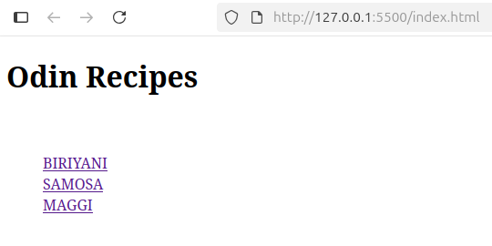

# Odin Recipes Project 🍳

This project is my first website built as part of The Odin Project's curriculum. The goal was to practice all the HTML concepts I've learned so far, including creating a basic structure, adding text, lists, images, and links.

---

## 📖 About The Project

This website consists of a main index page which has links to a few different recipes. Each recipe page then provides details about that dish. This project demonstrates a foundational understanding of HTML5.

The main skills and concepts practiced are:
* Creating a standard HTML5 boilerplate.
* Using various headings and paragraphs.
* Inserting images and linking to different pages.
* Creating ordered and unordered lists for ingredients and steps.
* Using Git for version control and GitHub for hosting.

---

## 🛠️ Built With

* HTML5

---

## 🚀 Live Demo

You can view the live site here:
**[Live Demo](https://sneakyram.github.io/odin-recipes/)**

---

##  Acknowledgements

* A huge thank you to **[The Odin Project](https://www.theodinproject.com/)** for providing the amazing curriculum that made this project possible.

---

## 👤 Contact

**SneakyRam**
* GitHub: [@SneakyRam](https://github.com/SneakyRam)